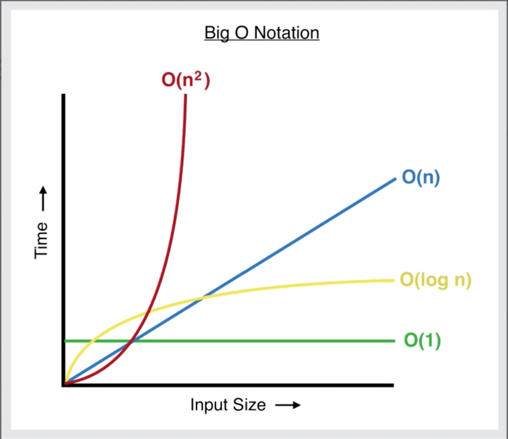

# 시간복잡도 (Time Complexity)

- 알고리즘이 문제를 해결하는 데 걸리는 시간을 나타내는 척도
- 시간 복잡도가 작을수록 더 빠른 알고리즘
- 최악, 평균, 최선의 경우로 나누어 평가함
- 일반적으로 빅-오 표기법을 사용해 나타냄

# Big-O 표기법 (점근 표기법, Big-O Notation)

Big-O 표기법은 최악의 경우를 고려해 나타내는 방법  ***“이 정도 시간까지 걸릴 수 있다”***



## Big-O 표기법 종류

### O(1)

- 입력값이 증가해도 연산 횟수가 일정하다.
- 반복문이 없으면 대체로 O(1)

```jsx
function printFunc(n) {
	console.log(n[0]);
}

printFunc([2, 3]) // 2
printFunc([2, 3, 4, 5, 6, 7, 8, 9, 10]) // 2
```

### O(n)

- 입력값이 증가함에 따라 연산 횟수가 n에 비례해서 증가한다.
- 반복문

```jsx
function printFunc(n) {
	for(let i = 0; i < n.length; i++) {
		// ...
	}
}
```

### O(n^2)

- 입력값이 증가함에 따라 연산 횟수가 n의 제곱수에 비례해서 증가한다.
- 대표적인 예시 : 이중 for 문

```jsx
function printFunc(n) {
	for(let i = 0; i < n.length; i++) {
		for(let j = 0; j < n.length; j++) {
			// ...
		}
	}
}
```

### O(2^n)

- 입력값이 커질수록 연산 횟수가 2^n에 비례해서 증가한다.
- Big-O 표기법 중 가장 느린 시간 복잡도
- 대표적인 예시 : 재귀로 구현하는 피보나치 수열

```jsx
function fib(n) {
  return n <= 1 ? n : fib(n - 1) + fib(n - 2);
}
```

### O(lg n)

- 입력값이 커질수록 연산 횟수가 lg n에 비례해서 증가한다.

```jsx
// 2의 거듭제곱을 출력하는 함수
function printFunc(n) {
	i = 1;
	while (i < n) {
		console.log(i);
		i *= 2;
	}
}
```

- n 이 128이면 반복문은 총 7번 실행됨 → `lg n` 에 비례함

## 복잡도 비교

```
O(1) < O(log n) < O(n) < O(n^2) < O(2^n)
```
